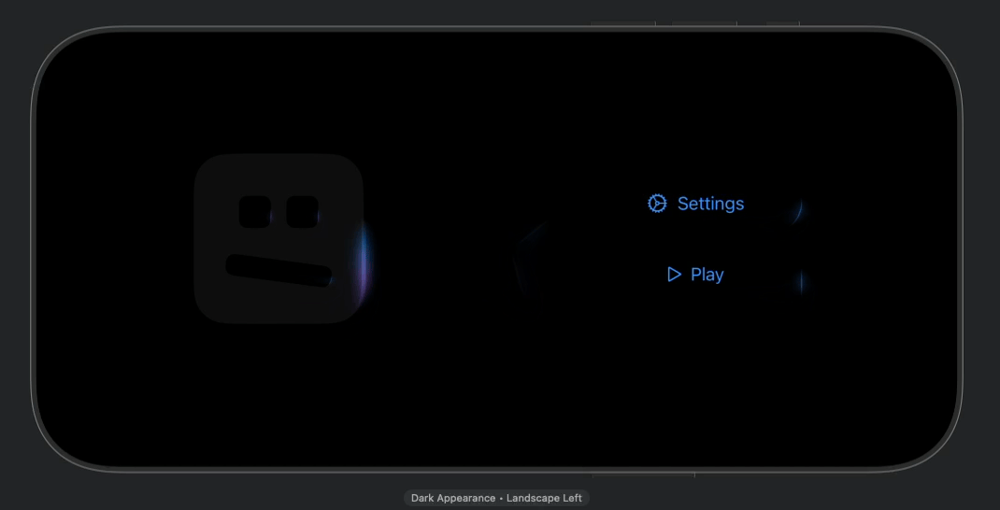

# GlowEffectKit

<p align="center">
  
</p>

SwiftUI package that provides an animated glow effect backed by a bundled Metal shader.

## Preview



## Requirements

- iOS 18.0+
- macOS 15.0+
- Swift 6.0+

## Installation

Add the package with Swift Package Manager and pin it to version `1.1.0`:

```text
https://github.com/didisouzacosta/GlowEffectKit.git
```

If you prefer SSH, use the repository remote:

```text
git@github.com:didisouzacosta/GlowEffectKit.git
```

In Xcode, choose **File > Add Package Dependencies...**, paste the repository
URL, set the dependency rule to **Exact Version**, enter `1.1.0`, and add the
`GlowEffectKit` library product to your app target.

If you manage dependencies in `Package.swift`, add:

```swift
.package(
    url: "https://github.com/didisouzacosta/GlowEffectKit.git",
    exact: "1.1.0"
)
```

During local DressMatch development, this package can still be linked from a
local checkout. For shared or CI builds, prefer the GitHub package URL above
with an explicit version.

## Usage

GlowEffectKit supports the default rounded-rectangle glow and any SwiftUI
`Shape`. Pass `shape:` when the glow should follow a custom outline, such as a
star, circle, capsule, or any shape backed by a custom `Path`.

```swift
//
//  ContentView.swift
//  Example
//
//  Created by Didi on 30/06/26.
//

import SwiftUI
import GlowEffectKit

struct ContentView: View {
    var body: some View {
        HStack(spacing: 32) {
            RoboFace()
            Star()
            Buttons()
        }
    }
}

private struct RoboFace: View {

    var body: some View {
        RoundedRectangle(cornerRadius: 32)
            .foregroundStyle(.gray.opacity(0.1))
            .frame(width: 160, height: 160)
            .glowEffect(
                isActive: true,
                lineWidth: 8
            )
            .overlay {
                VStack(spacing: 32) {
                    HStack(spacing: 16) {
                        RoundedRectangle(cornerRadius: 8)
                            .foregroundStyle(.black)
                            .frame(width: 30, height: 30)
                            .glowEffect(
                                isActive: true,
                                cornerRadius: 8,
                                lineWidth: 1
                            )

                        RoundedRectangle(cornerRadius: 8)
                            .foregroundStyle(.black)
                            .frame(width: 30, height: 30)
                            .glowEffect(
                                isActive: true,
                                cornerRadius: 8,
                                lineWidth: 1
                            )
                    }

                    RoundedRectangle(cornerRadius: 8)
                        .foregroundStyle(.black)
                        .frame(width: 100, height: 20)
                        .glowEffect(
                            isActive: true,
                            cornerRadius: 8,
                            lineWidth: 1
                        )
                        .rotationEffect(.radians(-25))
                }
            }
    }
}

private struct Star: View {
    
    var body: some View {
        StarShape()
            .fill(.clear)
            .frame(width: 160, height: 160)
            .glowEffect(
                isActive: true,
                shape: StarShape(),
                lineWidth: 4
            )
    }
    
}

private struct Buttons: View {
    var body: some View {
        VStack(spacing: 16) {
            Button(action: {}) {
                Label("Settings", systemImage: "gear")
                    .padding()
                    .frame(width: 200)
            }
            .glowEffect(isActive: true, lineWidth: 2)

            Button(action: {}) {
                Label("Play", systemImage: "play")
                    .padding()
                    .frame(width: 200)
            }
            .glowEffect(isActive: true, cornerRadius: 0, lineWidth: 2)
        }
    }
}

private struct StarShape: Shape {
    var points: Int = 5
    var innerRadiusRatio: CGFloat = 0.42

    func path(in rect: CGRect) -> Path {
        let center = CGPoint(x: rect.midX, y: rect.midY)
        let outerRadius = min(rect.width, rect.height) / 2
        let innerRadius = outerRadius * innerRadiusRatio
        let totalPoints = points * 2

        var path = Path()

        for index in 0..<totalPoints {
            let radius = index.isMultiple(of: 2) ? outerRadius : innerRadius
            let angle = CGFloat(index) * .pi * 2 / CGFloat(totalPoints) - .pi / 2
            let point = CGPoint(
                x: center.x + radius * cos(angle),
                y: center.y + radius * sin(angle)
            )

            if index == 0 {
                path.move(to: point)
            } else {
                path.addLine(to: point)
            }
        }

        path.closeSubpath()
        
        return path
    }
}

#Preview {
    ContentView()
}
```

The `shape:` overload strokes the path produced by the supplied shape. For
images or complex view hierarchies, pass the shape that represents the outline
you want the glow to follow.

Use `GlowEffectConfiguration` when the caller needs to tune shader amplitude or frame interval:

```swift
let configuration = GlowEffectConfiguration(
    peakScale: 1.02,
    duration: 2.0,
    glowOpacity: 0.24,
    amplitude: 2.5,
    minimumTimelineInterval: 1.0 / 30.0
)

content.glowEffect(isActive: isLoading, configuration: configuration)
```

## License

GlowEffectKit is available under the MIT license. See `LICENSE` for details.
